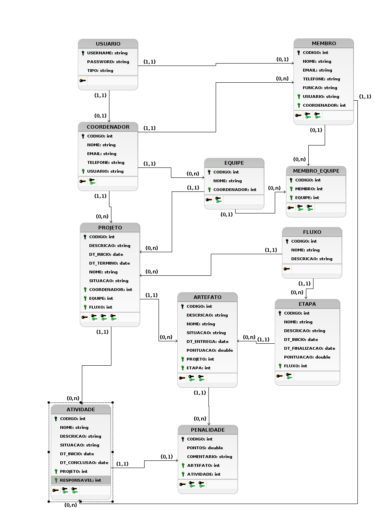
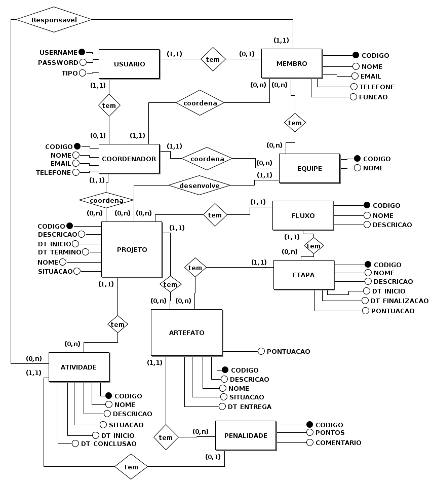

# Modelo Conceitual e Modelo de Dados

## Descrição

Este documento oferece uma representação visual dos dados da plataforma Academic
Dev Flow. A partir dele é possível entender como se dá a organização dos dados
presentes na plataforma, as entidades que fazem parte do projeto e seu
funcionamento geral.

### Histórico de revisões

| Data       | Versão | Descrição         | Autor                   |
| ---------- | ------ | ----------------- | ----------------------- |
| 02/10/2022 | 1.0    | Documento inicial | Adriel Faria dos Santos |

## Modelo conceitual

### Descrição das entidades

#### **Usuário**

Contém as informações necessárias para login e realização de ações no sistema

#### **Membro**

_Usuário_ que participa no desenvolvimento de _projetos_

#### **Coordenador**

_Usuário_ que coordena _membros_, _projetos_ e _equipes_

#### **Equipe**

Conjunto de _membros_ que participa de um _projeto_

#### **Projeto**

Representa um projeto que tem deu desenvolvimento acompanhado na plataforma

#### **Fluxo**

Representa o fluxo de desenvolvimento escolhido para um determinado _projeto_

#### **Etapa**

Representa uma etapa de um _fluxo_ de desenvolvimento

#### **Atividade**

Representa uma atividade realizada durante o desenvolvimento de um _projeto_

#### **Artefato**

Representa um item qualquer que tenha sido prduzido durante o desenvolvimento de
um _projeto_

#### **Penalidade**

Representa um decréscimo de pontuação pelo atraso ou não entrega de um
_artefato_

## Modelo de dados

## Dicionário de dados

| Entidade    | Atributo   | Limites e restrições                                             |
| ----------- | ---------- | ---------------------------------------------------------------- |
| ARTEFATO    | DESCRICAO  | Campo opicional                                                  |
| ARTEFATO    | PONTUACAO  | Não pode assumir valores negativos                               |
| ATIVIDADE   | DESCRICAO  | Campo opicional                                                  |
| COORDENADOR | TELEFONE   | Deve possuir DDD                                                 |
| ETAPA       | DESCRICAO  | Campo opicional                                                  |
| ETAPA       | PONTUACAO  | Não pode assumir valores negativos                               |
| FLUXO       | DESCRICAO  | Campo opicional                                                  |
| MEMBRO      | TELEFONE   | Deve possuir DDD                                                 |
| PENALIDADE  | COMENTARIO | Campo opicional                                                  |
| PENALIDADE  | PONTOS     | Não pode assumir valores negativos                               |
| PROJETO     | DESCRICAO  | Campo opicional                                                  |
| USUARIO     | TIPO       | Pode assumir valores **Administrador**, **Aluno**, **Professor** |

## Referências

[Documento padrão de Modelo Conceitual e Modelo de Dados usado no BSI](https://docs.google.com/document/d/1cxzXiWN149Nq5htoB88HZVE0GmWTnHemAwHrNYXif98/edit)
